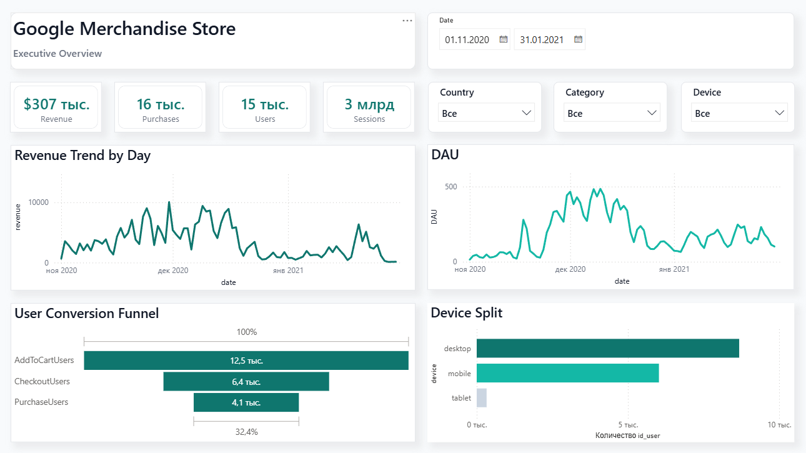
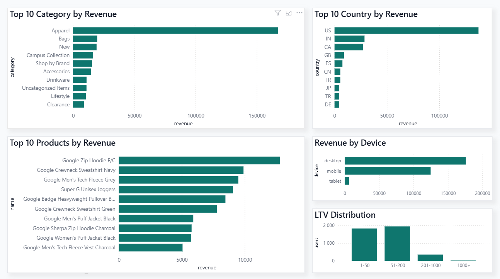

# Google Merchandise Store Product Analytics Dashboard

## Overview

This project demonstrates an end-to-end product analytics workflow using Python and Power BI.

Using ecommerce event data from the Google Merchandise Store, I transformed raw user activity logs into a business-oriented analytical dataset and built an interactive dashboard focused on user behavior, conversion performance, revenue trends, and product insights.

The project simulates a real-world Product Analytics / BI Analytics case and showcases data preparation, metric development, business analysis, and dashboard design.

---

## Business Objective

The goal of the project was to answer several key business questions:

* How many users interact with the product?
* How does revenue evolve over time?
* Where do users drop off in the conversion funnel?
* Which categories generate the most revenue?
* Which products contribute the most to sales?
* How does customer behavior differ across devices?
* What does the customer LTV distribution look like?

---

## Dataset

Source: Google Merchandise Store Ecommerce Dataset

Dataset:
https://www.kaggle.com/datasets/mexwell/google-merchandise-sales-data

The dataset contains anonymized Google Analytics ecommerce events, product information, user-level attributes, and customer lifetime value metrics.

Period covered:

* November 2020
* December 2020
* January 2021

---

## Data Preparation

Data processing was performed in Python using Pandas and Jupyter Notebook.

Main preparation steps:

* Data quality assessment
* Missing value analysis
* Datetime transformation
* Dataset joins and consolidation
* Feature engineering
* Revenue calculations
* DAU calculations
* Funnel metric calculations
* LTV segmentation

The final analytical table contains:

* 758,884 records
* 17 analytical fields

---

## Key Metrics

| Metric              | Value    |
| ------------------- | -------- |
| Revenue             | $307,114 |
| Users               | 14,701   |
| Sessions            | 18,034   |
| Purchases           | 15,555   |
| Average Order Value | $19.74   |

---

## Conversion Funnel

User-based conversion rates:

| Step                   | Conversion |
| ---------------------- | ---------- |
| Add to Cart → Checkout | 51.0%      |
| Checkout → Purchase    | 63.5%      |
| Add to Cart → Purchase | 32.4%      |

The largest user drop-off occurs between the Add-to-Cart and Checkout stages, indicating a potential optimization opportunity within the purchase journey.

---

## Dashboard Structure

### Executive Overview

The first page provides a high-level summary of business performance.

Included visuals:

* Revenue KPI
* Users KPI
* Sessions KPI
* Purchases KPI
* Revenue Trend
* Daily Active Users Trend
* Conversion Funnel
* Device Distribution

### Product Performance

The second page focuses on revenue and customer value drivers.

Included visuals:

* Revenue by Category
* Revenue by Country
* Revenue by Device
* Top Products by Revenue
* Customer LTV Distribution

---

## Technology Stack

* Power BI
* Python
* Pandas
* Jupyter Notebook
* SQL
* GitHub

---

## Repository Structure

* data/ — dataset description
* notebooks/ — data preparation notebook
* dashboard/ — Power BI dashboard
* screenshots/ — dashboard screenshots
* exports/ — analytical dataset

---

## Dashboard Preview

### Executive Overview

### Product Performance

---

## Author

Portfolio project created to demonstrate Product Analytics, Business Intelligence, and Data Analytics skills using Power BI and Python.
